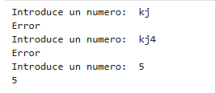
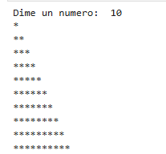
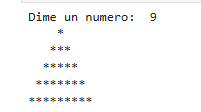
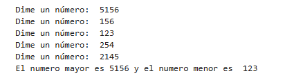
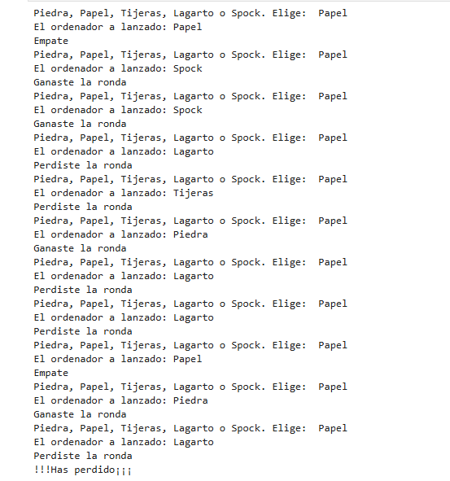

# Ejercicios básicos en Python
## Ejercicio 1) 
### Lectura de un número válido
```
usuario = input("Introduce un numero: ")
while(not usuario.isdigit()):
    print("Error")
    usuario = input("Introduce un numero: ")
print(usuario)
```
El resultado quedaria asi:



## Ejercicio 2) 
### Tabla de multiplicar
```
valorN = int(input("Dime tu valorN: "))
valorK = int(input("Dime tu valorK: "))

for item in range(1, valorK + 1):
    solucion = valorN * item
    print(valorN, "*", item, "=", solucion)
```
El resultado quedaria asi:


## Ejercicio 3) 
### Triángulo de asteriscos
```
numero = int(input("Dime un numero: "))
for item in range(1, numero + 1):
    print("*" * item)
```
El resultado quedaria asi:



## Ejercicio 4) 
### Pirámide de asteriscos
```
numero = int(input("Dime un numero: "))
while(numero % 2 == 0):
    print("El numero no es impar")
    numero = int(input("Dime un numero: "))

for item in range(1, numero + 1, 2):
    espacio = (numero - item) // 2
    print(' ' * espacio + "*" * item + ' ' * espacio)
```
El resultado quedaria asi:



## Ejercicio 5) 
### Número mayor y menor
```
import math
numeroMayor = -math.inf 
numeroMenor = math.inf 
for numeros in range(5):
    numero = int(input("Dime un número: "))
    if numero > numeroMayor:
        numeroMayor = numero
    if numero < numeroMenor:
        numeroMenor = numero
print("El numero mayor es", numeroMayor, "y el numero menor es ", numeroMenor)
```
El resultado quedaria asi:



## Ejercicio 6) 
### Conversión de unidades
```
valor = float(input("Dime un número: "))
unidad  = input("Dime un unidad de medida: ")
unidadConvertir = input("Dime un unidad de medida a la que quieres pasar: ")
match unidad:
    case 'km':
        match unidadConvertir:
            case 'mm':
                valor = valor * 1000000
            case 'cm':
                valor = valor * 100000
            case 'm':
                valor = valor * 1000
    case 'm':
        match unidadConvertir:
            case 'mm':
                valor = valor * 1000
            case 'cm':
                valor = valor * 100
            case 'km':
                valor = valor / 1000
    case 'cm':
        match unidadConvertir:
            case 'mm':
                valor = valor * 10
            case 'm':
                valor = valor / 100
            case 'km':
                valor = valor / 100000
    case 'mm':
        match unidadConvertir:
            case 'cm':
                valor = valor / 10
            case 'm':
                valor = valor / 1000
            case 'km':
                valor = valor / 1000000
    case _:
        print("No lo conozco")
print(valor)
```
El resultado quedaria asi:


## Ejercicio 7) 
### Acierta el número
```
from random import *
numeroAdivinar = randint(0, 100)
numero = int(input("Dime un numero: "))
while(numero != numeroAdivinar):
    if numero < numeroAdivinar:
        print("El numero a adivinar es mas grande")
    if numero > numeroAdivinar:
        print("El numero a adivinar es mas pequeño")
    numero = int(input("Dime un numero: "))
print("¡¡¡HACERTASTE EL NÚMERO!!!")
```

El resultado quedaria asi:


## Ejercicio 8) 
### Piedra, papel, tijeras, lagarto o spock
```
import random

tiradaGanadas=0
tiradaPerdidas=0
while tiradaGanadas<5 and tiradaPerdidas < 5:
    tirada = input("Piedra, Papel, Tijeras, Lagarto o Spock. Elige: ")
    tiradaordenador = random.choice(["Piedra", "Papel", "Tijeras", "Lagarto", "Spock"])
    print("El ordenador a lanzado: "+ tiradaordenador)
    match tirada:
        case'Piedra':
            if tiradaordenador =='Papel' or tiradaordenador == 'Spock':
                tiradaPerdidas+=1
                print("Perdiste la ronda")
            elif tiradaordenador == 'Tijeras' or tiradaordenador == 'Lagarto':
                tiradaGanadas+=1
                print("Ganaste la ronda")
            else:
                print("Empate")
        case'Papel':
            if tiradaordenador == 'Lagarto' or tiradaordenador == 'Tijeras':
                tiradaPerdidas+=1
                print("Perdiste la ronda")
            elif tiradaordenador == 'Piedra' or tiradaordenador == 'Spock':
                tiradaGanadas+=1
                print("Ganaste la ronda")
            else:
                print("Empate")
        case'Tijeras':
            if tiradaordenador == 'Piedra' or tiradaordenador == 'Spock':
                tiradaPerdidas+=1
                print("Perdiste la ronda")
            elif tiradaordenador == 'Papel' or tiradaordenador == 'Lagarto':
                tiradaGanadas+=1
                print("Ganaste la ronda")
            else:
                print("Empate")
        case'Lagarto':
            if tiradaordenador == 'Tijeras' or tiradaordenador == 'Piedra':
                tiradaPerdidas+=1
                print("Perdiste la ronda")
            elif tiradaordenador == 'Spock' or tiradaordenador == 'Papel':
                tiradaGanadas+=1
                print("Ganaste la ronda")
            else:
                print("Empate")
        case'Spock':
            if tiradaordenador == 'Lagarto' or tiradaordenador == 'Papel':
                tiradaPerdidas+=1
                print("Perdiste la ronda")
            elif tiradaordenador == 'Piedra' or tiradaordenador == 'Tijeras':
                tiradaGanadas+=1
                print("Ganaste la ronda")
            else:
                print("Empate")
if tiradaGanadas == 5:
    print("¡Felicidades! Has ganado")
else:
    print("!!!Has perdido¡¡¡")
```
El resultado quedaria asi:



## Ejercicio 9) 
### Secuencia de Fibonacci
```
numero = int(input("Dime un numero: "))
n1 = 1
print(n1)
n2 = 1
print(n2)

for i in range(3, numero + 1):
    resultado = n1 + n2
    n1 = n2
    n2 = resultado
    print(resultado)
``` 

El resultado quedaria asi:

