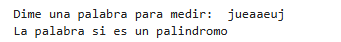

# Ejercicios de cadenas
## Ejercicio 1) 
### Contar vocales y consonantes
```
palabra = input("Dime una palabra para medir: ")
def Contar(valor):
    vocales="aeiouAEIOU"
    numVocales = 0
    numConsonantes = 0
    for count in valor:
        if count.isalpha():
            if count.strip(" "):
                if count in vocales:
                    numVocales += 1
                else:
                    numConsonantes += 1
    return numVocales, numConsonantes
    
valor = palabra
numVocales, numConsonantes = Contar(valor)
print("La cantidad de vocales que hay son: ", numVocales, "y La cantidad de consonantes que hay son: ", numConsonantes)
```
El resultado quedaria asi:


## Ejercicio 2) 
### Invertir una cadena
```
palabra = input("Dime una palabra para medir: ")
def cambiar_orden(valor):
    palabraInversa = ""
    
    for cambio in valor:
        if cambio.isalpha():
            palabraInversa = palabra[::-1]
    return palabraInversa
valor = palabra
palabraInversa = cambiar_orden(valor)
print(palabraInversa)
```
El resultado quedaria asi:


## Ejercicio 3) 
### Verificar palíndromo
```
palabra = input("Dime una palabra para medir: ")
def palindromo(valor):
    palabraInversa = palabra[::-1]
    if palabra.isalpha():
        if palabra.lower:
            if palabra == palabraInversa:
                return True
            else:
                return False
if palindromo(valor):
    print("La palabra si es un palindromo")
else:
    print("La palabra no es un palindromo")
```
El resultado quedaria asi:



## Ejercicio 4) 
### Contar palabras
```
palabra = input("Dime una frase para medir: ")
def contar_palaba(valor):
    palabras = palabra.split()
    return len(palabras)
num_palabras = contar_palaba(valor)
print("La frase esta compuesta por: ", num_palabras, "palabras")
```
El resultado quedaria asi:


## Ejercicio 5) 
### Eliminar caracteres repetidos
```
palabra = input("Dime una palabra: ")
def duplicados(cadena):
    resultado = ""
    vistos = set()
    for char in cadena:
        if char not in vistos:
            resultado += char
            vistos.add(char)
    return resultado

cadena = palabra
resultado = duplicados(cadena)
print("Cadena:", resultado)
```
El resultado quedaria asi:


## Ejercicio 6) 
### Mayúsculas y minúsculas
```
palabra = input("Dime una frase: ")
def cambiar(letra):
    resultado = ""
    for char in letra:
        if char.islower():
            resultado += char.upper()
        elif char.isupper():
            resultado += char.lower()
        else:
            resultado += char
    return resultado
    
letra = palabra
cambiada = cambiar(letra)
print("Frase convertida:", cambiada)
```
El resultado quedaria asi:


## Ejercicio 7) 
### Invertir palabras de una cadena
```
palabra = input("Dime una frase: ")
lista = palabra.split(" ")
lista.reverse()
print("Frase invertida:", " ".join(lista))
```
El resultado quedaria asi:


## Ejercicio 8) 
### Anagrama
```
palabra1 = input("Dime una palabra1: ")
palabra2 = input("Dime una palabra2: ")
def anagrama(palabra1, palabra2):
    lista1 = list(palabra1.lower())
    lista2 = list(palabra2.lower())
    lista1.sort()
    lista2.sort()
    return lista1 == lista2
    
if anagrama(palabra1, palabra2):
    print("Las palabras son anagramas")
else:
    print("Las palabras no son anagramas")
```
El resultado quedaria asi:


## Ejercicio 9)
### Frecuencia de caracteres
```
palabra = input("Dime una palabra: ")
def frecuencia(cadena):
    frecuencia = {}
    for char in cadena:
        if char in frecuencia:
            frecuencia[char] += 1
        else:
            frecuencia[char] = 1
    return frecuencia
    
cadena = palabra
resultado = frecuencia(cadena)
print(resultado)
```
El resultado quedaria asi:


## Ejercicio 10)
### Quitar caracteres alfanuméricos
```
#Ejercicio10
palabra = input("Dime una palabra: ")
def alfanumerico(cadena):
    resultado = "".join(char for char in cadena if char.isalnum())
    return resultado
cadena = palabra
resultado = alfanumerico(cadena)
print("Cadena: ", resultado)
```
El resultado quedaria asi:


## Ejercicio 11)
### Transformar a camelCase
```
palabra = input("Dime una palabra: ")
def camelCase(cadena):
    palabras = cadena.replace("-", " ").split()
    resultado = palabras[0].lower()
    for palabra in palabras[1:]:
        resultado += palabra.title()
    return resultado

cadena = palabra
resultado = camelCase (cadena)
print("Cadena: ", resultado)
```
El resultado quedaria asi:


## Ejercicio 12)
### Codificación RLE (Run-Length Enconding)
```
palabra = input("Dime una palabra: ")
def codificar(cadena):
    if not cadena:
        return ""
    resultado = ""
    cont = 1
    for i in range(1, len(cadena)):
        if cadena[i] == cadena[i - 1]:
            cont += 1
        else:
            resultado += cadena[i - 1] + str(cont)
            cont = 1
    resultado += cadena[-1] + str(cont)
    return resultado

cadena = palabra
resultado = codificar(cadena)
print("Cadena:", resultado)
```
El resultado quedaria asi:

