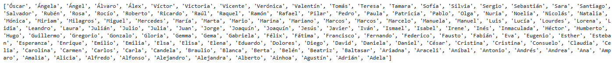
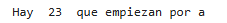
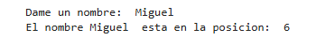
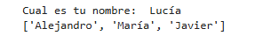
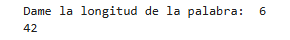
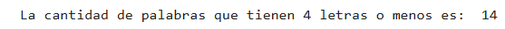

# 1. Operaciones con listas
Para todos los apartados se utilizara la siguiente lista:
```
nombres = [
    "Alejandro", "María", "Javier", "Lucía", "Carlos", "Sofía", "Miguel", "Ana", "Manuel", "Isabel", "Pedro", "Carmen", "Jorge", "Elena", "Juan", "Laura", "Antonio", "Patricia", "David", "Claudia", "Francisco", "Marta", "Sergio", "Teresa", "Luis", "Raquel", "Andrés", "Paula", "Daniel", "Verónica", "Fernando", "Sara", "Pablo", "Irene", "Álvaro", "Natalia", "Hugo", "Eva", "Diego", "Cristina", "Jesús", "Rosa", "Roberto", "Alicia", "Ángel", "Beatriz", "Ricardo", "Julia", "Adrián", "Silvia", "Alberto", "Victoria", "Raúl", "Pilar", "Ramón", "Lidia", "Óscar", "Ariadna", "Gonzalo", "Mónica", "Rubén", "Esther", "Santiago", "Nuria", "Iván", "Ainhoa", "Eduardo", "Berta", "Marcos", "Noelia", "Enrique", "Elisa", "Emilio", "Fátima", "Vicente", "Gabriela", "Mario", "Olga", "Rafael", "Lorena", "Mariano", "Cristina", "Eugenio", "Mercedes", "Félix", "Amparo", "Sebastián", "Rocío", "Alfredo", "Esperanza", "Álex", "Celia", "Héctor", "Andrea", "Tomás", "Inés", "Marcelo", "Gloria", "Marina", "Belén", "Valentín", "Miriam", "Guillermo", "Ángela", "Joaquín", "Gemma", "Fabián", "Daniela", "Víctor", "Dolores", "Marcos", "Tamara", "Braulio", "Lourdes", "Federico", "Gema", "Julián", "Nicolás", "Leandro", "Manuela", "Agustín", "Elsa", "Julio", "Consuelo", "Ismael", "Alejandra", "Joaquín", "Milagros", "Gregorio", "Inmaculada", "Salvador", "Carla", "Esteban", "Carolina", "Fausto", "Emilia", "Alfonso", "Amalia", "Baltasar", "Adela", "Humberto", "Blanca", "Aníbal", "Araceli", "César", "Candela"
]
```

## Ejercicio 1) 
### Ordenando elementos:
```
nombres.sort()
nombres.reverse()
print(nombres)
```


## Ejercicio 2) 
### Contando elementos:
```
contador = 0 
for nombre in nombres: 
    if nombre[0] in 'aAáÁ':
        contador += 1 
print("Hay ", contador, " que empiezan por a")
```


## Ejercicio 3) 
### Buscar un elementos:
```
nombre = input("Dame un nombre: ")
if nombre in nombres:
    posicion = nombres.index(nombre)
    print("El nombre", nombre , " esta en la posicion: ", posicion)
else:
    print("El nombre no esta definido")
```



## Ejercicio 4) 
### Primeros elementos:
```
nombre = input("Cual es tu nombre: ")
if nombre in nombres:
    posicion = nombres.index(nombre)
    anterior = nombres[:posicion]
    print(anterior)
else:
    print("El nombre no esta definido")
```


## Ejercicio 5) 
### Obtener número de nombres de una longitud:
```
longitud = int(input("Dame la longitud de la palabra: "))
cont = 0
for nombre in nombres:
    if len(nombre) == longitud:
        cont += 1
print(cont)
```


## Ejercicio 6) 
### Nombres cortos: 
```
cont = 0
for nombre in nombres:
    if len(nombre) <= 4:
        cont += 1
print("La cantidad de palabras que tienen 4 letras o menos es: ", cont)
```



# 2. Más ejercicios con listas

## Ejercicio 1)
### Sumar elementos de una lista:
```

```
![Imagenes]

## Ejercicio 2) 
### Contar elementos específicos:
```

```
![Imagenes]

## Ejercicio 3) 
### Eliminar duplicados:
```

```
![Imagenes]

## Ejercicio 4) 
### Máximo y mínimo: 
```

```
![Imagenes]

## Ejercicio 5) 
### Filtrar números pares:
```

```
![Imagenes]

## Ejercicio 6) 
### Revertir una lista:
```

```
![Imagenes]
