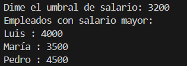

# Ejercicios con diccionarios
## Ejercicio 1)
### Buscar valor en un diccionario
```
frutas = { "manzana": 1.2, "platano": 0.8, "naranja": 1.5, "pera": 1.3, "uva": 2.0 }
fruta = input("Ingresa el nombre de una fruta: ").lower()
if fruta in frutas: 
    print(f"El precio de la", fruta, " es", frutas[fruta]) 
else: 
    print(f"Lo siento, la fruta", fruta, "no está disponible.")
```
El resultado quedaria asi:


## Ejercicio 2)
### Contar elementos en un diccionario
```
productos = {
    "Electrónica": ["Smartphone", "Laptop", "Tablet", "Auriculares", "Smartwatch"],
    "Hogar": ["Aspiradora", "Microondas", "Lámpara", "Sofá", "Cafetera"],
    "Ropa": ["Camisa", "Pantalones", "Chaqueta", "Zapatos", "Bufanda"],
    "Deportes": ["Pelota de fútbol", "Raqueta de tenis", "Bicicleta", "Pesas", "Cuerda de saltar"],
    "Juguetes": ["Muñeca", "Bloques de construcción", "Peluche", "Rompecabezas", "Coche de juguete"],
}
numCategorias = len(productos)

numProductos = {categoria: len(productos[categoria]) for categoria in productos}
numProductosTotal = sum(numProductos.values())

print("Numero de categorias:", numCategorias)
print("Numero de productos:", numProductos)
print("Numero de productos totales:", numProductosTotal)
```
El resultado quedaria asi:


## Ejercicio 3) 
### Contador de frecuencias de palabras
```
palabra = input("Ingresa una frase: ")
def contar(palabra):
    palabras = palabra.split() 
    frecuencia = {}

    for palabra in palabras:
        if palabra in frecuencia:
            frecuencia[palabra] += 1
        else:
            frecuencia[palabra] = 1
    return frecuencia
frecuencia = contar(palabra)
print("Frecuencia de palabras:", frecuencia)
```
El resultado quedaria asi:


## Ejercicio 5) 
### Diccionario invertido
```
diccionario = {"manzana": 1, "platano": 2, "naranja": 3} 
def invertir(diccionario): 
    return {valor: clave for clave, valor in diccionario.items()} 
diccionarioInvertido = invertir(diccionario) 
print("Diccionario invertido:", diccionarioInvertido)
```
El resultado quedaria asi:


## Ejercicio 6) 
### Combinar dos diccionarios
```
productos1 = {"manzana": 1.2, "platano": 0.8, "naranja": 1.5}
productos2 = {"platano": 0.9, "pera": 1.3, "naranja": 1.4}
def combinar(dic1, dic2):
    combinado = dic1.copy()
    for clave, valor in dic2.items():
        if clave in combinado:
            combinado[clave] += valor
        else:
            combinado[clave] = valor
    return combinado
productos = combinar(productos1, productos2)
print("Productos combinados:", productos)
```
El resultado quedaria asi:


## Ejercicio 7) 
### Filtrar claves y valores
```
empleados = { "Ana": 3000, "Carlos": 2500, "Luis": 4000, "María": 3500, "Jorge": 2800, "Sofía": 3100, "Pedro": 4500 }
palabra = int(input("Dime el umbral de salario: "))
empleadosFiltrados = {empleado: salario for empleado, salario in empleados.items() if salario > palabra}
print("Empleados con salario mayor:")
for empleado, salario in empleadosFiltrados.items():
        print(empleado, ":", salario)
```
El resultado quedaria asi:

