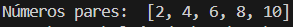
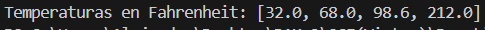
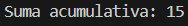
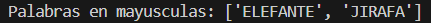
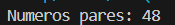
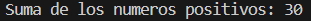

# Ejercicios de programación funcional
## Ejercicio 1)
### Filtrado de una lista de números
```
numeros = [1, 2, 3, 4, 5, 6, 7, 8, 9, 10]
pares = list(filter(lambda x: x % 2 == 0, numeros))
print("Números pares: ", pares)
```
El resultado quedaria asi:



## Ejercicio 2)
### Mapeo de temperaturas
```
celsius = [0, 20, 37, 100]
fahrenheit = list(map(lambda x: (x * 9/5) + 32, celsius))
print("Temperaturas en Fahrenheit:", fahrenheit)
```
El resultado quedaria asi:



## Ejercicio 3) 
### Suma acumulativa
```
from functools import reduce
numeros = [1, 2, 3, 4, 5]
suma = reduce(lambda x, y: x + y, numeros)
print("Suma acumulativa:", suma)
```
El resultado quedaria asi:



## Ejercicio 4) 
### Palabras con cierta longitud
```
palabras = ["perro", "gato", "elefante", "oso", "jirafa"]
mayusculas = list(map(lambda x: x.upper(), filter(lambda x: len(x) > 5, palabras)))
print("Palabras en mayusculas:", mayusculas)
```
El resultado quedaria asi:



## Ejercicio 5)
### Multiplicación de pares
```
from functools import reduce
numeros = [1, 2, 3, 4, 5, 6]
pares = reduce(lambda x, y: x * y, filter(lambda x: x % 2 == 0, numeros))
print("Numeros pares:", pares)
```
El resultado quedaria asi:



## Ejercicio 6)
### Combinar operaciones en listas anidadas
```
from functools import reduce
numeros = [[-3, 2, 7], [10, -5, 3], [0, 8, -2]]
suma = reduce(lambda x, y: x + y, filter(lambda x: x > 0, [num for sublist in numeros for num in sublist]))
print("Suma de los numeros positivos:", suma)
```
El resultado quedaria asi:

