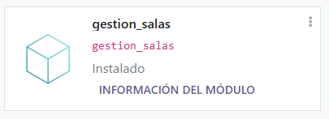
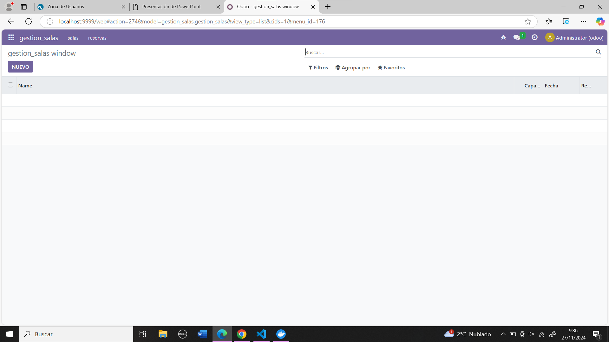

# Entorno de desarrollo y primer módulo Odoo

## Codigo modificado para Realizar este modulo:
### El models quedaria asi:
```
from odoo import models, fields, api


class gestion_salas(models.Model):
    _name = 'gestion_salas.gestion_salas'
    _description = 'gestion_salas.gestion_salas'

    name = fields.Char()
    capacity = fields.Integer()
    fecha =  fields.Date()
    reserva = fields.Boolean()
    
    description = fields.Text()
```
---
### El views quedaria asi:
```
<odoo>
  <data>
    <!-- explicit list view definition -->

    <record model="ir.ui.view" id="gestion_salas.list">
      <field name="name">gestion_salas list</field>
      <field name="model">gestion_salas.gestion_salas</field>
      <field name="arch" type="xml">
        <tree>
          <field name="name"/>
          <field name="capacity"/>
          <field name="fecha"/>
          <field name="reserva"/>
        </tree>
      </field>
    </record>

    <!-- actions opening views on models -->

    <record model="ir.actions.act_window" id="gestion_salas.action_window">
      <field name="name">gestion_salas window</field>
      <field name="res_model">gestion_salas.gestion_salas</field>
      <field name="view_mode">tree,form</field>
    </record>

    <!-- server action to the one above -->
<!--
    <record model="ir.actions.server" id="gestion_salas.action_server">
      <field name="name">gestion_salas server</field>
      <field name="model_id" ref="model_gestion_salas_gestion_salas"/>
      <field name="state">code</field>
      <field name="code">
        action = {
          "type": "ir.actions.act_window",
          "view_mode": "tree,form",
          "res_model": model._name,
        }
      </field>
    </record>
-->

    <!-- Top menu item -->

    <menuitem name="gestion_salas" id="gestion_salas.menu_root"/>

    <!-- menu categories -->

    <menuitem name="salas" id="gestion_salas.menu_1" parent="gestion_salas.menu_root"/>
    <menuitem name="reservas" id="gestion_salas.menu_2" parent="gestion_salas.menu_root"/>

    <!-- actions -->

    <menuitem name="salas" id="gestion_salas.menu_1_list" parent="gestion_salas.menu_1"
              action="gestion_salas.action_window"/>
    <menuitem name="reservas" id="gestion_salas.menu_2_list" parent="gestion_salas.menu_2"
              action="gestion_salas.action_window"/>

  </data>
</odoo>
```
---

## Capturas del módulo ejecutado en odoo:


