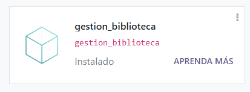
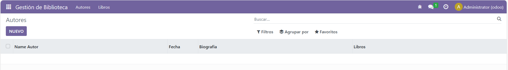
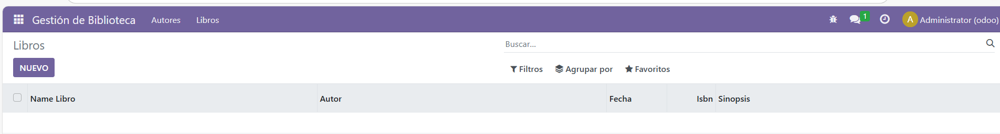

# Módulo con dos modelos

## Los models quedarian asi:
### __init__.py
```
# -*- coding: utf-8 -*-

from . import models_autor
from . import models_books
```

### models_autor.py
```
# -*- coding: utf-8 -*-

from odoo import models, fields, api


class gestion_biblioteca(models.Model):
    _name = 'gestion_biblioteca.autor'
    _description = 'gestion_biblioteca.gestion_biblioteca'

    name_autor = fields.Char()
    fecha = fields.Date()
    biografia = fields.Text()
    libros = fields.Text()

    @api.depends('value')
    def _value_pc(self):
        for record in self:
            record.value2 = float(record.value) / 100
```

### models_books.py
```
# -*- coding: utf-8 -*-

from odoo import models, fields, api


class gestion_biblioteca(models.Model):
    _name = 'gestion_biblioteca.libro'
    _description = 'gestion_biblioteca.gestion_biblioteca'

    name_libro = fields.Char()
    autor = fields.Char()
    fecha = fields.Date()
    isbn = fields.Integer()
    sinopsis = fields.Text()

    @api.depends('value')
    def _value_pc(self):
        for record in self:
            record.value2 = float(record.value) / 100
```


## Los views quedarian asi:
### views.xml
```
<odoo>
  <data>
    <!-- Top menu item --> 

    <menuitem name="gestion_biblioteca" id="gestion_biblioteca.menu_root"/> 


    <!-- Menu categories --> 

    <menuitem name="Autores" id="gestion_biblioteca.menu_1" parent="gestion_biblioteca.menu_root"/>
  </data>
</odoo>
```

### views_autor.xml
```
<odoo>
  <data>
    <!-- List View -->
    <record model="ir.ui.view" id="gestion_biblioteca.list">
      <field name="name">gestion_biblioteca list</field>
      <field name="model">gestion_biblioteca.autor</field>
      <field name="arch" type="xml">
        <tree>
          <field name="name_autor"/>
          <field name="fecha"/>
          <field name="biografia"/>
          <field name="libros"/>
        </tree>
      </field>
    </record>

    <!-- Window Action -->
    <record model="ir.actions.act_window" id="gestion_biblioteca.author_action_window">
      <field name="name">Autores</field>
      <field name="res_model">gestion_biblioteca.autor</field>
      <field name="view_mode">tree,form</field>
    </record>

    <!-- Menu Item -->
    <menuitem name="Autores" id="gestion_biblioteca.menu_1_list" parent="gestion_biblioteca.menu_1" action="gestion_biblioteca.author_action_window"/>
  </data>
</odoo>
```

### views_books.xml
```
<odoo>
  <data>
    <record model="ir.ui.view" id="gestion_biblioteca.book_list">
      <field name="name">gestion_biblioteca book list</field>
      <field name="model">gestion_biblioteca.libro</field>
      <field name="arch" type="xml">
        <tree>
          <field name="name_libro"/>
          <field name="autor"/>
          <field name="fecha"/>
          <field name="isbn"/>
          <field name="sinopsis"/>
        </tree>
      </field>
    </record>

    <record model="ir.actions.act_window" id="gestion_biblioteca.book_action_window">
      <field name="name">Libros</field>
      <field name="res_model">gestion_biblioteca.libro</field>
      <field name="view_mode">tree,form</field>
    </record>

    <menuitem name="Gestión de Biblioteca" id="gestion_biblioteca.menu_root" sequence="1"/>
    <menuitem name="Libros" id="gestion_biblioteca.menu_2_list" parent="gestion_biblioteca.menu_root" action="gestion_biblioteca.book_action_window"/>
  </data>
</odoo>
```

## Capturas del módulo ejecutado en odoo:


### Autor


### Libreria


