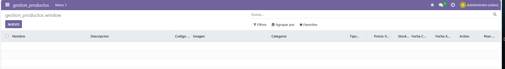

# Campos del modelo

## Los models quedarian asi:
### models.py
```
# -*- coding: utf-8 -*-

from odoo import models, fields, api #type:ignore


class gestion_productos(models.Model):
    _name = 'gestion_productos.gestion_productos'
    _description = 'gestion_productos.gestion_productos'

    nombre = fields.Char()
    descripcion = fields.Text()
    codigo_producto = fields.Float(String='Codigo', required=True)
    imagen = fields.Image()
    categoria = fields.Selection([
        ('jardin', 'Jardín'),
        ('hogar', 'Hogar'),
        ('electrodomesticos', 'Electrodomésticos')
    ])
    tipo_producto = fields.Boolean()
    precio_venta = fields.Float()
    stock_disponible = fields.Integer()
    fecha_creacion = fields.Date()
    fecha_actualizacion = fields.Date()
    activo = fields.Boolean()
    peso_producto = fields.Float()
```

## Los views quedarian asi:
### views.xml

```
<odoo>
  <data>
    <!-- explicit list view definition -->

    <record model="ir.ui.view" id="gestion_productos.list">
      <field name="name">gestion_productos list</field>
      <field name="model">gestion_productos.gestion_productos</field>
      <field name="arch" type="xml">
        <tree>
          <field name="nombre"/>
          <field name="descripcion"/>
          <field name="codigo_producto"/>
          <field name="imagen"/>
          <field name="categoria"/>
          <field name="tipo_producto"/>
          <field name="precio_venta"/>
          <field name="stock_disponible"/>
          <field name="fecha_creacion"/>
          <field name="fecha_actualizacion"/>
          <field name="activo"/>
          <field name="peso_producto"/>

        </tree>
      </field>
    </record>


    <!-- actions opening views on models -->

    <record model="ir.actions.act_window" id="gestion_productos.action_window">
      <field name="name">gestion_productos window</field>
      <field name="res_model">gestion_productos.gestion_productos</field>
      <field name="view_mode">tree,form</field>
    </record>


    <!-- Top menu item -->

    <menuitem name="gestion_productos" id="gestion_productos.menu_root"/>

    <!-- menu categories -->

    <menuitem name="Menu 1" id="gestion_productos.menu_1" parent="gestion_productos.menu_root"/>
    <menuitem name="Menu 2" id="gestion_productos.menu_2" parent="gestion_productos.menu_root"/>

    <!-- actions -->

    <menuitem name="List" id="gestion_productos.menu_1_list" parent="gestion_productos.menu_1"
              action="gestion_productos.action_window"/>
  </data>
</odoo>
```

## Capturas del módulo ejecutado en odoo:
