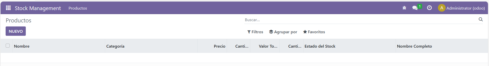

# Campos calculados y restricciones
## Los models quedarian asi:
### models.py
```
from odoo import models, fields, api
from odoo.exceptions import ValidationError

class StockProduct(models.Model):
    _name = 'stock.product'
    _description = 'Producto en Stock'

    name = fields.Char(string='Nombre', required=True, unique=True)
    category = fields.Selection([
        ('microprocesadores', 'Microprocesadores'),
        ('tarjetas_graficas', 'Tarjetas Gráficas'),
        ('memorias_ram', 'Memorias RAM'),
    ], string='Categoría', required=True)
    price = fields.Float(string='Precio', required=True)
    quantity = fields.Integer(string='Cantidad en Stock', required=True)
    total_value = fields.Float(string='Valor Total', compute='_compute_total_value', store=True)
    minimum_quantity = fields.Integer(string='Cantidad Mínima', required=True)
    stock_status = fields.Selection([
        ('normal', 'Normal'),
        ('low_stock', 'Low Stock'),
    ], string='Estado del Stock', compute='_compute_stock_status', store=True)
    full_name = fields.Char(string='Nombre Completo', compute='_compute_full_name', store=True)

    @api.depends('price', 'quantity')
    def _compute_total_value(self):
        for record in self:
            record.total_value = record.price * record.quantity

    @api.depends('quantity', 'minimum_quantity')
    def _compute_stock_status(self):
        for record in self:
            if record.quantity > record.minimum_quantity:
                record.stock_status = 'normal'
            else:
                record.stock_status = 'low_stock'

    @api.depends('name', 'category')
    def _compute_full_name(self):
        for record in self:
            record.full_name = f"{record.name} ({record.category})"

    @api.constrains('price')
    def _check_price(self):
        for record in self:
            if record.price <= 0:
                raise ValidationError("El precio debe ser mayor que 0.")

    @api.constrains('quantity')
    def _check_quantity(self):
        for record in self:
            if record.quantity < 0:
                raise ValidationError("La cantidad en stock debe ser mayor o igual a 0.")

    @api.constrains('total_value')
    def _check_total_value(self):
        for record in self:
            if record.total_value > 100000:
                raise ValidationError("El valor total del stock no puede ser superior a 100000 unidades monetarias.")

    @api.constrains('category')
    def _check_category(self):
        for record in self:
            if not record.category:
                raise ValidationError("No se permiten productos sin categoría.")
```

## Los views quedarian asi:
### views.xml
```
<odoo>
    <record id="action_stock_products" model="ir.actions.act_window">
        <field name="name">Productos</field>
        <field name="res_model">stock.product</field>
        <field name="view_mode">tree,form</field>
    </record>

    <record id="view_stock_product_tree" model="ir.ui.view">
        <field name="name">stock.product.tree</field>
        <field name="model">stock.product</field>
        <field name="arch" type="xml">
            <tree>
                <field name="name"/>
                <field name="category"/>
                <field name="price"/>
                <field name="quantity"/>
                <field name="total_value"/>
                <field name="minimum_quantity"/>
                <field name="stock_status"/>
                <field name="full_name"/>
            </tree>
        </field>
    </record>

    <record id="view_stock_product_form" model="ir.ui.view">
        <field name="name">stock.product.form</field>
        <field name="model">stock.product</field>
        <field name="arch" type="xml">
            <form>
                <sheet>
                    <group>
                        <field name="name"/>
                        <field name="category"/>
                        <field name="price"/>
                        <field name="quantity"/>
                        <field name="minimum_quantity"/>
                        <field name="total_value"/>
                        <field name="stock_status"/>
                        <field name="full_name"/>
                    </group>
                </sheet>
            </form>
        </field>
    </record>

    <menuitem id="menu_stock_management_root" name="Stock Management"/>

    <menuitem id="menu_stock_management_products" name="Productos" parent="menu_stock_management_root" action="action_stock_products"/>
</odoo>
```

## Capturas del módulo ejecutado en odoo:
