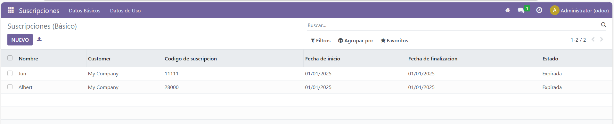
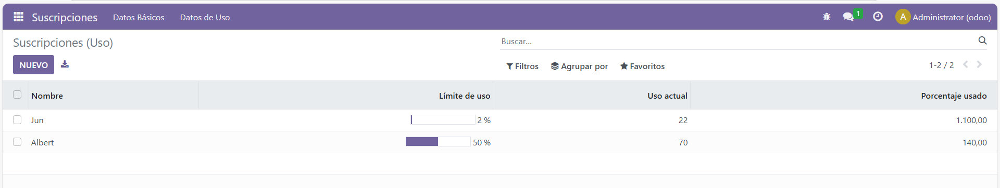

# Vista de tipo lista
## Los models quedarian asi:
### subscription.py
```
from odoo import models, fields, api

class Subscription(models.Model):
    _name = 'subscription.subscription'
    _description = 'Gestión de suscripciones'

    name = fields.Char(string="Nombre", required=True)
    customer_id = fields.Many2one('res.partner', required=True)
    subscription_code = fields.Char(string="Codigo de suscripcion", required=True)
    start_date = fields.Date(string="Fecha de inicio", required=True)
    end_date = fields.Date(string="Fecha de finalizacion")
    status = fields.Selection(
        [('active', 'Activa'), ('expired', 'Expirada'), ('pending', 'Pendiente'), ('cancelled', 'Cancelada')],
        string="Estado", required=True
    )
    usage_limit = fields.Integer(string="Limite de uso")
    current_usage = fields.Integer(string="Uso actual")
    use_percent = fields.Float(string="Porcentaje", compute="_compute_use_percent", store=True)

    @api.depends('usage_limit', 'current_usage')
    def _compute_use_percent(self):
        for record in self:
            if record.usage_limit:
                record.use_percent = (record.current_usage / record.usage_limit) * 100
            else:
                record.use_percent = 0

    def add_15_days(self):
        for record in self:
            if record.end_date:
                record.end_date += fields.Date.timedelta(days=15)
```

## Los views quedarian asi:
### views.xml
```
<odoo>
  <data>
    <record id="view_subscription_tree_basic" model="ir.ui.view">
      <field name="name">subscription.tree.basic</field>
      <field name="model">subscription.subscription</field>
      <field name="arch" type="xml">
        <tree>
          <field name="name"/>
          <field name="customer_id"/>
          <field name="subscription_code"/>
          <field name="start_date"/>
          <field name="end_date"/>
          <field name="status"/>
        </tree>
      </field>
    </record>

    <record id="view_subscription_tree_usage" model="ir.ui.view">
      <field name="name">subscription.tree.usage</field>
      <field name="model">subscription.subscription</field>
      <field name="arch" type="xml">
        <tree>
          <field name="name" string="Nombre"/>
          <field name="usage_limit" string="Límite de uso" widget="progressbar"/>
          <field name="current_usage" string="Uso actual"/>
          <field name="use_percent" string="Porcentaje usado"/>
        </tree>
      </field>
    </record>

    <record id="action_subscription_basic" model="ir.actions.act_window">
      <field name="name">Suscripciones (Básico)</field>
      <field name="res_model">subscription.subscription</field>
      <field name="view_mode">tree,form</field>
      <field name="view_id" ref="view_subscription_tree_basic"/>
    </record>

    <record id="action_subscription_usage" model="ir.actions.act_window">
      <field name="name">Suscripciones (Uso)</field>
      <field name="res_model">subscription.subscription</field>
      <field name="view_mode">tree,form</field>
      <field name="view_id" ref="view_subscription_tree_usage"/>
    </record>

    <menuitem name="Suscripciones" id="menu_subscription_root" sequence="1"/>
    <menuitem name="Datos Básicos" id="menu_subscription_basic" parent="menu_subscription_root"
              action="action_subscription_basic" sequence="10"/>
    <menuitem name="Datos de Uso" id="menu_subscription_usage" parent="menu_subscription_root"
              action="action_subscription_usage" sequence="20"/>
  </data>
</odoo>
```

## Capturas del módulo ejecutado en odoo:

