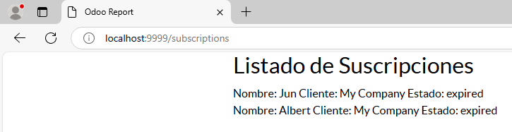

# Vista de tipo formulario
## Los cambios serian:
### list_web.xml
```
    <odoo>
    <template id="list_web" name="Listado de Suscripciones">
        <t t-call="web.html_container">
            <t t-call-assets="web.report_assets_common" t-js="false"/>
            <div class="container">
                <h2>Listado de Suscripciones</h2>
                <t t-if="records">
                    <t t-foreach="records" t-as="record">
                        <div class="subscription-item">
                            <span>Nombre: <t t-esc="record.name or 'Sin Nombre'"/></span>
                            <span>Cliente: <t t-esc="record.customer_id.name or 'N/A'"/></span>
                            <span>Estado: <t t-esc="record.status or 'Desconocido'"/></span>
                        </div>
                    </t>
                </t>
                <t t-else="">
                    <p>No hay suscripciones disponibles.</p>
                </t>
            </div>
        </t>
    </template>
</odoo>
```
### subscription_views.xml
```
<odoo>
    <data>
        <record id="view_subscription_form" model="ir.ui.view">
            <field name="name">subscription.form</field>
            <field name="model">subscription.subscription</field>
            <field name="arch" type="xml">
                <form>
                    <header>
                        <button name="add_15_days" string="Añadir 15 días" type="object" class="oe_highlight"/>
                    </header>
                    <sheet>
                        <div class="oe_title">
                            <h1>
                                <field name="name"/>
                            </h1>
                        </div>
                        <group>
                            <field name="customer_id" string="Cliente"/>
                            <field name="subscription_code" string="Código de Suscripción"/>
                        </group>
                        <notebook>
                            <page string="Datos Básicos">
                                <group>
                                    <field name="start_date" string="Fecha de Inicio"/>
                                    <field name="end_date" string="Fecha de Fin" widget="remaining_days"/>
                                    <field name="status" string="Estado" widget="radio"/>
                                    <field name="price" string="Precio"/>
                                </group>
                            </page>
                            <page string="Datos de Uso">
                                <group>
                                    <field name="usage_limit" string="Límite de Uso" widget="progressbar"/>
                                    <field name="current_usage" string="Uso Actual"/>
                                    <field name="use_percent" string="Porcentaje Usado"/>
                                </group>
                            </page>
                        </notebook>
                    </sheet>
                </form>
            </field>
        </record>

        <record id="action_subscription_form" model="ir.actions.act_window">
            <field name="name">Formulario de Suscripción</field>
            <field name="res_model">subscription.subscription</field>
            <field name="view_mode">form,tree</field>
            <field name="view_id" ref="view_subscription_form"/>
        </record>
    </data>
</odoo>
```


### metricas_views.xml
```
<odoo>
    <data>
        <record id="view_metricas_form" model="ir.ui.view">
            <field name="name">metricas.form</field>
            <field name="model">subscription.metricas</field>
            <field name="arch" type="xml">
                <form>
                    <sheet>
                        <div class="oe_title">
                            <h1>
                                <field name="fecha"/>
                            </h1>
                        </div>
                        <group>
                            <field name="suscripciones_activas"/>
                            <field name="ingresos_generados"/>
                        </group>
                        <notebook>
                            <page string="Estadísticas">
                                <group>
                                    <field name="tasa_renovacion"/>
                                    <field name="tasa_cancelacion"/>
                                    <field name="arpu"/>
                                    <field name="tasa_conversion"/>
                                </group>
                            </page>
                            <page string="Clientes">
                                <group>
                                    <field name="clientes_recurrentes"/>
                                    <field name="nuevos_clientes"/>
                                    <field name="churn_rate"/>
                                </group>
                            </page>
                            <page string="Finanzas">
                                <group>
                                    <field name="ltv"/>
                                    <field name="cac"/>
                                    <field name="costo_adquisicion"/>
                                </group>
                            </page>
                            <page string="Notas">
                                <group>
                                    <field name="notas"/>
                                </group>
                            </page>
                        </notebook>
                    </sheet>
                </form>
            </field>
        </record>

        <record id="view_metricas_tree" model="ir.ui.view">
            <field name="name">metricas.tree</field>
            <field name="model">subscription.metricas</field>
            <field name="arch" type="xml">
                <tree>
                    <field name="fecha"/>
                    <field name="suscripciones_activas"/>
                    <field name="ingresos_generados"/>
                    <field name="tasa_renovacion"/>
                    <field name="tasa_cancelacion"/>
                    <field name="arpu"/>
                </tree>
            </field>
        </record>

        <record id="action_metricas" model="ir.actions.act_window">
            <field name="name">Métricas de Suscripciones</field>
            <field name="res_model">subscription.metricas</field>
            <field name="view_mode">tree,form</field>
            <field name="view_id" ref="view_metricas_tree"/>
        </record>
    </data>
</odoo>
```


### __manifest__.py
```
    # any module necessary for this one to work correctly
    'depends': ['base', 'web'],

    # always loaded
    'data': [
        'security/ir.model.access.csv',
        'views/views.xml',
        'views/templates.xml',
        'views/list_web.xml',
        'views/subscription_views.xml',
        'views/metricas_views.xml',
    ],
```

## Capturas del módulo ejecutado en odoo:
