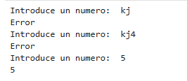
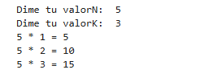
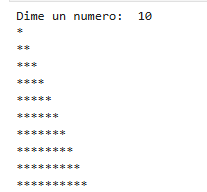
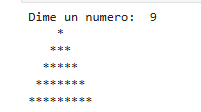
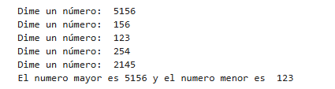
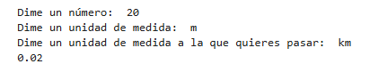
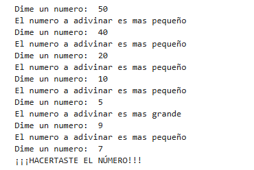
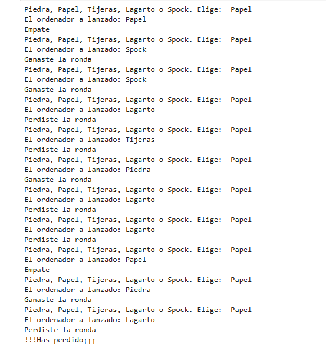

# SGE-aff

## ut02

### pr0201
**Pasos a realizar:**

1) Realización de un nuevo repositorio en Github.

2) Una vez creado debera vincularse a la carpeta creada con la misma estructura pedida en el ejercicio.

3) Posteriormente añadir la informacion (como estoy haciendo en este momento) de los pasos a realizar dentro del archivo ".md" desde el visual studio.

4) Una vez echo esto antes de subir los cambios a Github deberemos ir a "Settings" de nuestro resitorio e ir a "Pages" cambiando la opcion "none" por la opcion "main", para asi poder realizar una presentación del contenido mas vistoso y fluido (como en este precioso momento). 

### pr0202
**Pasos a realizar:**

1) 

## ut03
### pr0301


**Pasos a realizar para formular una factura:**

1) Lo primero sera añadir la opcion de las Facturas a nuestro Odoo

2) Una vez ya incluida lo que tendremos que hacer es añadir una compañia nueva y darle los valores que nos piden, seran los datos de la compañia como por ejemplo el nombre de esta su dirección su email...

3) Posterior mente nos dira que modifiquemos el formato de nuestras facturas, aqui se le añadira su fondo, formato....

4) Una vez echo esto tendremos que inportar los clientes. 

5) Y por ultimo realizaremos la factura con uno de los clientes que hemos incluido anteriormente, aqui se indicara el importe a pagar del objeto, material...


### pr0302


**Pasos a realizar para añadir fotos del inventario de Google:**

1) Lo primero sera añadir la opcion de las Productos a nuestro Odoo.

2) Luego iremos a Googles APIs y servicios y realizar un nuevo proyectopara poder obtener una nueva clave APIy una vez obtenida la nueva clave API deveremos ir a Custom Search API para ver los detalles.

3) Decpues iremos a Google Programmable Search Dashboard y crearemos un nuevo buscador, una vez creado este tendremos que darle a personalizar para obtener la IDv de buscador.

4) En Odoo iremos a Ajustes y desbloquearemos la opion de "Google Imágenes", en ella se pondran tanto la API como la ID de busqueda.

5) Y solo quedaria ir a los Productos, tendremos que insertar los valores de un archivo que nos an dado, y en la opcion de "Accion" le daremos a "Obtener imágenes de Google Imágenes" y se nos mostrara la foto que se relaciona a ese producto (no funciona con todos los productos).

### pr0303
**Pasos a realizar para conseguir una copia de seguridad en PostgreSQL:**

1) Realizaremos la copia de seguridad con el comando:
```
    pg_dump -U dbuser db_name > backup.sql
```

2)  Necesitaremos acceder a la terminal del servidor Postgres y para ello realizaremos el comando:
```
    docker-compose exec db bash
```
3) Ahora sacaremos el fichero del contenedor con el comando:
```
    docker cp contenedor:ruta_contenedor ruta_anfitrion
```

4) Despues copiar el fichero al contenedor:
```
    docker cp ruta_anfitrion contenedor:ruta_contenedor
```

5) Posteriormente crearemos la base de datos con el comando:
```
    createdb -U odoo -O odoo odoo
```

6) Y por ultimo volcaremos el contenido de la copia de seguridad con el comando:
```
    psql -U odoo odoo < backup.sql
```

## ut04

### PR0401: Ejercicios básicos en Python

**Ejercicio 1)**
```
usuario = input("Introduce un numero: ")
while(not usuario.isdigit()):
    print("Error")
    usuario = input("Introduce un numero: ")
print(usuario)
```
El resultado quedaria asi:



**Ejercicio 2)**
```
valorN = int(input("Dime tu valorN: "))
valorK = int(input("Dime tu valorK: "))

for item in range(1, valorK + 1):
    solucion = valorN * item
    print(valorN, "*", item, "=", solucion)
```
El resultado quedaria asi:



**Ejercicio 3)**
```
numero = int(input("Dime un numero: "))
for item in range(1, numero + 1):
    print("*" * item)
```
El resultado quedaria asi:



**Ejercicio 4)**
```
numero = int(input("Dime un numero: "))
while(numero % 2 == 0):
    print("El numero no es impar")
    numero = int(input("Dime un numero: "))

for item in range(1, numero + 1, 2):
    espacio = (numero - item) // 2
    print(' ' * espacio + "*" * item + ' ' * espacio)
```
El resultado quedaria asi:



**Ejercicio 5)**
```
import math
numeroMayor = -math.inf 
numeroMenor = math.inf 
for numeros in range(5):
    numero = int(input("Dime un número: "))
    if numero > numeroMayor:
        numeroMayor = numero
    if numero < numeroMenor:
        numeroMenor = numero
print("El numero mayor es", numeroMayor, "y el numero menor es ", numeroMenor)
```
El resultado quedaria asi:



**Ejercicio 6)**
```
valor = float(input("Dime un número: "))
unidad  = input("Dime un unidad de medida: ")
unidadConvertir = input("Dime un unidad de medida a la que quieres pasar: ")
match unidad:
    case 'km':
        match unidadConvertir:
            case 'mm':
                valor = valor * 1000000
            case 'cm':
                valor = valor * 100000
            case 'm':
                valor = valor * 1000
    case 'm':
        match unidadConvertir:
            case 'mm':
                valor = valor * 1000
            case 'cm':
                valor = valor * 100
            case 'km':
                valor = valor / 1000
    case 'cm':
        match unidadConvertir:
            case 'mm':
                valor = valor * 10
            case 'm':
                valor = valor / 100
            case 'km':
                valor = valor / 100000
    case 'mm':
        match unidadConvertir:
            case 'cm':
                valor = valor / 10
            case 'm':
                valor = valor / 1000
            case 'km':
                valor = valor / 1000000
    case _:
        print("No lo conozco")
print(valor)
```
El resultado quedaria asi:



**Ejercicio 7)**
```
from random import *
numeroAdivinar = randint(0, 100)
numero = int(input("Dime un numero: "))
while(numero != numeroAdivinar):
    if numero < numeroAdivinar:
        print("El numero a adivinar es mas grande")
    if numero > numeroAdivinar:
        print("El numero a adivinar es mas pequeño")
    numero = int(input("Dime un numero: "))
print("¡¡¡HACERTASTE EL NÚMERO!!!")
```

El resultado quedaria asi:



**Ejercicio 8)**
```
import random

tiradaGanadas=0
tiradaPerdidas=0
while tiradaGanadas<5 and tiradaPerdidas < 5:
    tirada = input("Piedra, Papel, Tijeras, Lagarto o Spock. Elige: ")
    tiradaordenador = random.choice(["Piedra", "Papel", "Tijeras", "Lagarto", "Spock"])
    print("El ordenador a lanzado: "+ tiradaordenador)
    match tirada:
        case'Piedra':
            if tiradaordenador =='Papel' or tiradaordenador == 'Spock':
                tiradaPerdidas+=1
                print("Perdiste la ronda")
            elif tiradaordenador == 'Tijeras' or tiradaordenador == 'Lagarto':
                tiradaGanadas+=1
                print("Ganaste la ronda")
            else:
                print("Empate")
        case'Papel':
            if tiradaordenador == 'Lagarto' or tiradaordenador == 'Tijeras':
                tiradaPerdidas+=1
                print("Perdiste la ronda")
            elif tiradaordenador == 'Piedra' or tiradaordenador == 'Spock':
                tiradaGanadas+=1
                print("Ganaste la ronda")
            else:
                print("Empate")
        case'Tijeras':
            if tiradaordenador == 'Piedra' or tiradaordenador == 'Spock':
                tiradaPerdidas+=1
                print("Perdiste la ronda")
            elif tiradaordenador == 'Papel' or tiradaordenador == 'Lagarto':
                tiradaGanadas+=1
                print("Ganaste la ronda")
            else:
                print("Empate")
        case'Lagarto':
            if tiradaordenador == 'Tijeras' or tiradaordenador == 'Piedra':
                tiradaPerdidas+=1
                print("Perdiste la ronda")
            elif tiradaordenador == 'Spock' or tiradaordenador == 'Papel':
                tiradaGanadas+=1
                print("Ganaste la ronda")
            else:
                print("Empate")
        case'Spock':
            if tiradaordenador == 'Lagarto' or tiradaordenador == 'Papel':
                tiradaPerdidas+=1
                print("Perdiste la ronda")
            elif tiradaordenador == 'Piedra' or tiradaordenador == 'Tijeras':
                tiradaGanadas+=1
                print("Ganaste la ronda")
            else:
                print("Empate")
if tiradaGanadas == 5:
    print("¡Felicidades! Has ganado")
else:
    print("!!!Has perdido¡¡¡")
```
El resultado quedaria asi:



**Ejercicio 9)**
```

```

El resultado quedaria asi:

![Imagenes]