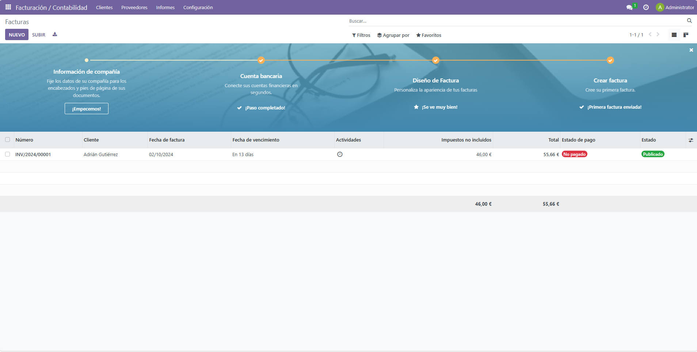
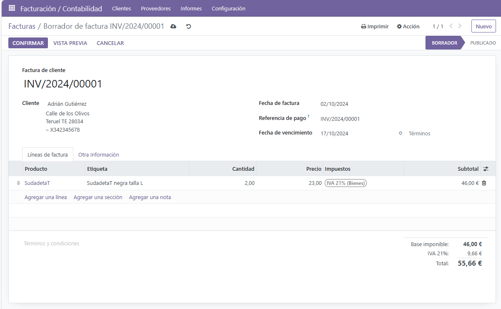
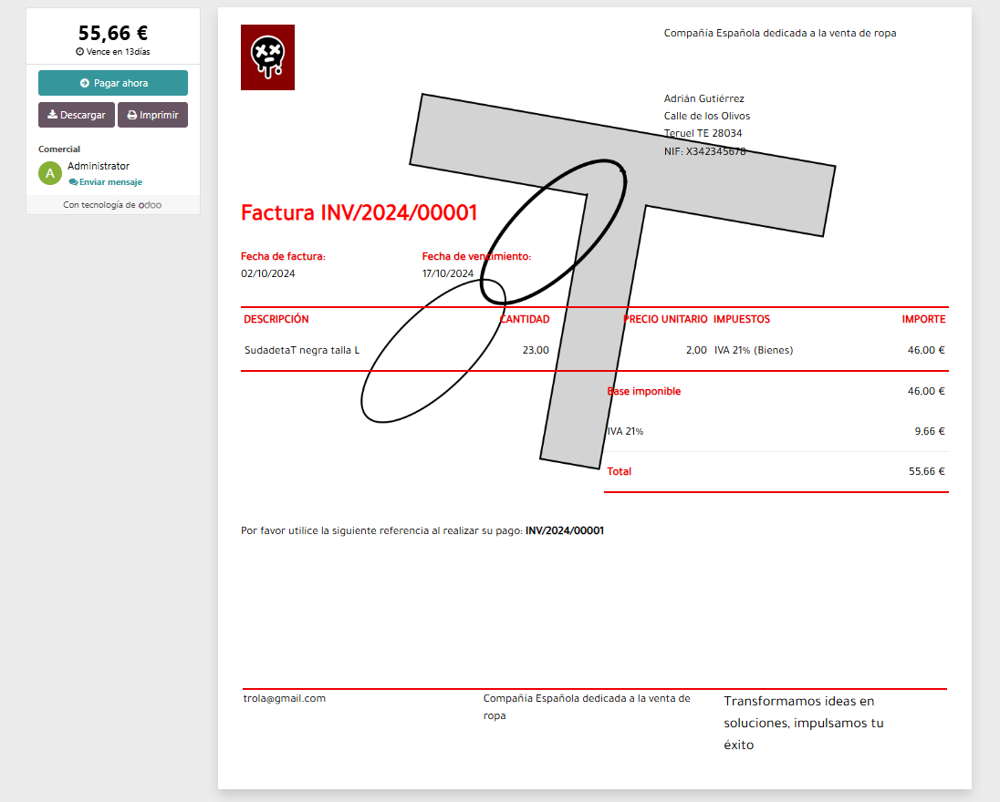

## Pasos a realizar para formular una factura:

1) Lo primero sera añadir la opcion de las Facturas a nuestro Odoo

2) Una vez ya incluida lo que tendremos que hacer es añadir una compañia nueva y darle los valores que nos piden, seran los datos de la compañia como por ejemplo el nombre de esta su dirección su email...

3) Posterior mente nos dira que modifiquemos el formato de nuestras facturas, aqui se le añadira su fondo, formato....

4) Una vez echo esto tendremos que inportar los clientes. 

5) Y por ultimo realizaremos la factura con uno de los clientes que hemos incluido anteriormente, aqui se indicara el importe a pagar del objeto, material...