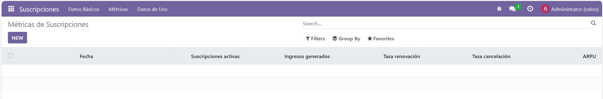
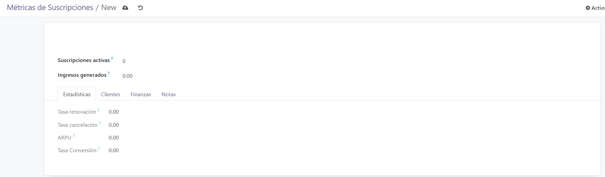
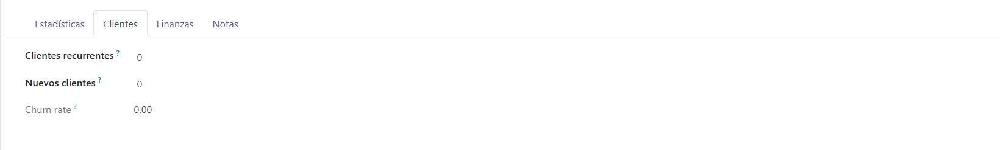
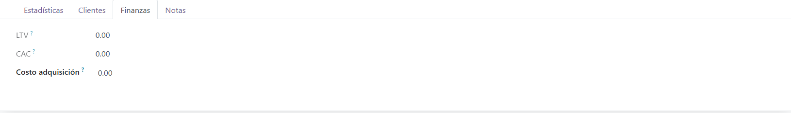
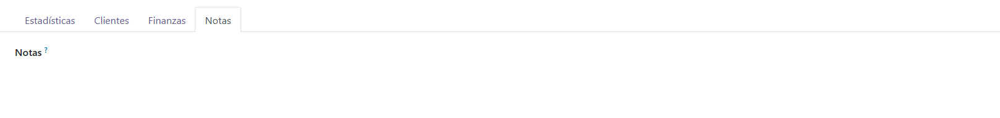
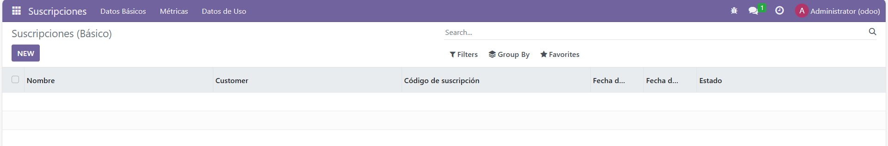
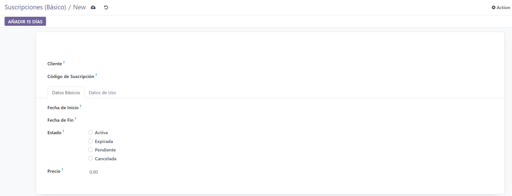
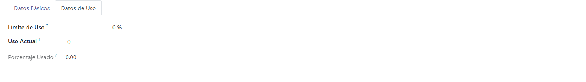
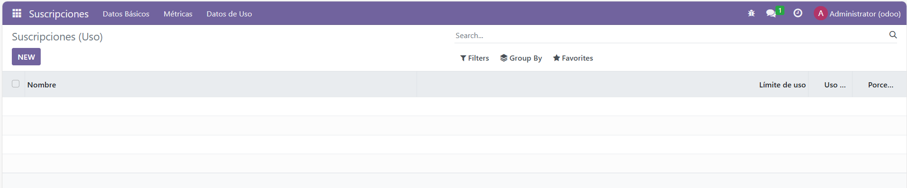

# Proyecto de la 2ª Evaluación. Extensión del modelo de suscripciones mediante métricas y estadísticas

## Cambios a realizar:

### modelo: metricas.py
```
    # -*- coding: utf-8 -*-
    from odoo import models, fields, api

    class SubscriptionMetricas(models.Model):
        _name = 'subscription.metricas'
        _description = 'Métricas de Suscripciones'

        fecha = fields.Date(string='Fecha')
        suscripciones_activas = fields.Integer(string='Suscripciones activas')
        ingresos_generados = fields.Float(string='Ingresos generados')
        renovaciones = fields.Integer(string='Renovaciones')
        cancelaciones = fields.Integer(string='Cancelaciones')
        nuevas_suscripciones = fields.Integer(string='Nuevas Suscripciones')
        cancelar_suscripciones = fields.Integer(string='Cancelar Suscripciones')
        clientes_recurrentes = fields.Integer(string='Clientes recurrentes')
        nuevos_clientes = fields.Integer(string='Nuevos clientes')
        visitantes = fields.Integer(string='Visitantes')
        costo_adquisicion = fields.Float(string='Costo adquisición')
        notas = fields.Text(string='Notas')
        tasa_renovacion = fields.Float(string='Tasa renovación', compute='_compute_tasa_renovacion', store=True)
        tasa_cancelacion = fields.Float(string='Tasa cancelación', compute='_compute_tasa_cancelacion', store=True)
        arpu = fields.Float(string='ARPU', compute='_compute_arpu', store=True)
        tasa_conversion = fields.Float(string='Tasa Conversión', compute='_compute_tasa_conversion', store=True)
        churn_rate = fields.Float(string='Churn rate', compute='_compute_churn_rate', store=True)
        ltv = fields.Float(string='LTV', compute='_compute_ltv', store=True)
        cac = fields.Float(string='CAC', compute='_compute_cac', store=True)
        subscription_ids = fields.One2many('subscription.subscription', 'metricas_id', string="Suscripciones")

        @api.depends('renovaciones', 'suscripciones_activas')
        def _compute_tasa_renovacion(self):
            for record in self:
                record.tasa_renovacion = (record.renovaciones / record.suscripciones_activas * 100) if record.suscripciones_activas > 0 else 0

        @api.depends('cancelaciones', 'suscripciones_activas')
        def _compute_tasa_cancelacion(self):
            for record in self:
                record.tasa_cancelacion = (record.cancelaciones / record.suscripciones_activas * 100) if record.suscripciones_activas > 0 else 0

        @api.depends('ingresos_generados', 'suscripciones_activas')
        def _compute_arpu(self):
            for record in self:
                record.arpu = (record.ingresos_generados / record.suscripciones_activas) if record.suscripciones_activas > 0 else 0

        @api.depends('nuevos_clientes', 'visitantes')
        def _compute_tasa_conversion(self):
            for record in self:
                record.tasa_conversion = (record.nuevos_clientes / record.visitantes * 100) if record.visitantes > 0 else 0

        @api.depends('cancelaciones', 'clientes_recurrentes', 'nuevos_clientes')
        def _compute_churn_rate(self):
            for record in self:
                total_clientes = record.clientes_recurrentes + record.nuevos_clientes
                record.churn_rate = (record.cancelaciones / total_clientes * 100) if total_clientes > 0 else 0

        @api.depends('arpu', 'churn_rate')
        def _compute_ltv(self):
            for record in self:
                record.ltv = (record.arpu * (1 / (record.churn_rate / 100))) if record.churn_rate > 0 else 0

        @api.depends('costo_adquisicion', 'nuevos_clientes')
        def _compute_cac(self):
            for record in self:
                record.cac = (record.costo_adquisicion / record.nuevos_clientes) if record.nuevos_clientes > 0 else 0

        def name_get(self):
            result = []
            for record in self:
                result.append((record.id, f"Métricas {record.fecha}"))
            return result
```

### modelo: subscription.py
```
    # -*- coding: utf-8 -*-
    from odoo import models, fields, api

    class Subscription(models.Model):
        _name = 'subscription.subscription'
        _description = 'Gestión de suscripciones'

        name = fields.Char(string="Nombre", required=True)
        customer_id = fields.Many2one('res.partner', required=True)
        subscription_code = fields.Char(string="Código de suscripción", required=True)
        start_date = fields.Date(string="Fecha de inicio", required=True)
        end_date = fields.Date(string="Fecha de finalización")
        status = fields.Selection(
            [('active', 'Activa'), ('expired', 'Expirada'), ('pending', 'Pendiente'), ('cancelled', 'Cancelada')],
            string="Estado", required=True
        )
        price = fields.Float(string="Precio")
        usage_limit = fields.Integer(string="Límite de uso")
        current_usage = fields.Integer(string="Uso actual")
        use_percent = fields.Float(string="Porcentaje usado", compute="_compute_use_percent", store=True)
        metricas_id = fields.Many2one('subscription.metricas', string="Métricas")

        @api.depends('usage_limit', 'current_usage')
        def _compute_use_percent(self):
            for record in self:
                if record.usage_limit:
                    record.use_percent = (record.current_usage / record.usage_limit) * 100
                else:
                    record.use_percent = 0

        def add_15_days(self):
            for record in self:
                if record.end_date:
                    record.end_date += fields.Date.timedelta(days=15)
```

### viata: metricas_views.xml
```
    <odoo>
        <record id="view_metricas_form" model="ir.ui.view">
            <field name="name">metricas.form</field>
            <field name="model">subscription.metricas</field>
            <field name="arch" type="xml">
                <form>
                    <sheet>
                        <div class="oe_title">
                            <h1>
                                <field name="fecha"/>
                            </h1>
                        </div>
                        <group>
                            <field name="suscripciones_activas"/>
                            <field name="ingresos_generados"/>
                        </group>
                        <notebook>
                            <page string="Estadísticas">
                                <group>
                                    <field name="tasa_renovacion"/>
                                    <field name="tasa_cancelacion"/>
                                    <field name="arpu"/>
                                    <field name="tasa_conversion"/>
                                </group>
                            </page>
                            <page string="Clientes">
                                <group>
                                    <field name="clientes_recurrentes"/>
                                    <field name="nuevos_clientes"/>
                                    <field name="churn_rate"/>
                                </group>
                            </page>
                            <page string="Finanzas">
                                <group>
                                    <field name="ltv"/>
                                    <field name="cac"/>
                                    <field name="costo_adquisicion"/>
                                </group>
                            </page>
                            <page string="Notas">
                                <group>
                                    <field name="notas"/>
                                </group>
                            </page>
                        </notebook>
                    </sheet>
                </form>
            </field>
        </record>

        <record id="view_metricas_tree" model="ir.ui.view">
            <field name="name">metricas.tree</field>
            <field name="model">subscription.metricas</field>
            <field name="arch" type="xml">
                <tree>
                    <field name="fecha"/>
                    <field name="suscripciones_activas"/>
                    <field name="ingresos_generados"/>
                    <field name="tasa_renovacion"/>
                    <field name="tasa_cancelacion"/>
                    <field name="arpu"/>
                </tree>
            </field>
        </record>

        <record id="action_metricas" model="ir.actions.act_window">
            <field name="name">Métricas de Suscripciones</field>
            <field name="res_model">subscription.metricas</field>
            <field name="view_mode">tree,form</field>
            <field name="view_id" ref="view_metricas_tree"/>
        </record>

        <menuitem name="Suscripciones" id="menu_subscription_root" sequence="1"/>
        <menuitem name="Métricas" id="menu_metricas_root" parent="menu_subscription_root" action="action_metricas" sequence="10"/>
    </odoo>
```


## Capturas del módulo ejecutado en odoo:
### Metricas:

---

---

---

---

---

### Suscripciones (Basico)

---

---

---

### Suscripciones (Uso)


---
#### El new seria igual que las imagenes de Suscripciones (Basico)


